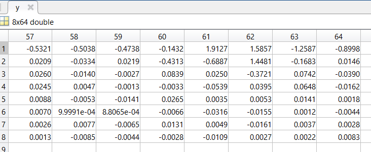
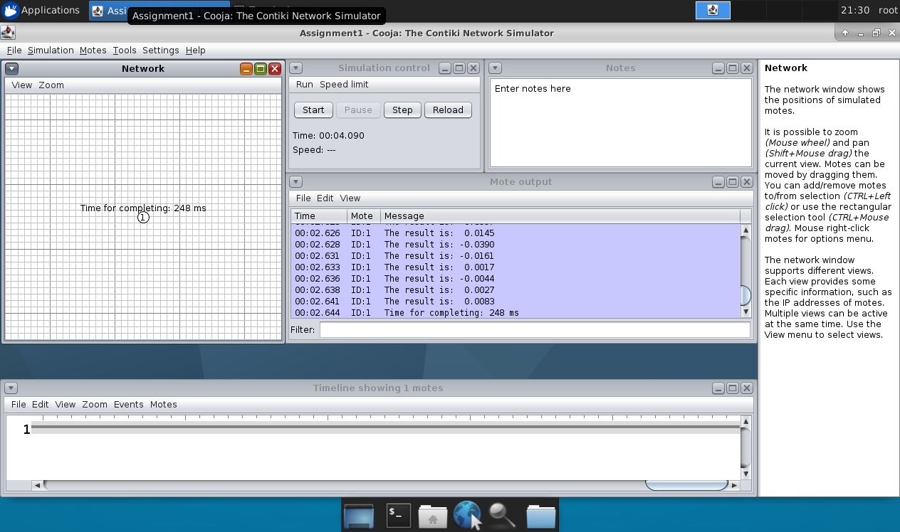

The screenshot of the steps for running the code on the Mote. The result shows, in this case, that the best channel in terms of Noise-floor (the most high powered value) is number 18. Accordingly with the datasheet in https://www.ti.com/product/CC2420, the RSSI value is always averaged over 8 symbol periods (128 μs) within a range of 100 dB.
The RSSI offset is approximately –45. For example if reading a value of –20 from the RSSI register, the RF input power is approximately  –65 dBm. 
 
The measurement (8 symbol periods) is made for 3 times in a second and averaged again for each channel. So after probing and stored value of each channel the best value is displayed.

The code is runned on a Linux virtual machine, previously setup via Vagrant. Cooja simulation envirnoment is used.
- In Cooja, make a "new simulation" on the top left menu "File"
- Add a "sky" types of mote
- Select the source code
- Compile it and run
- Set a speed limit of 100% (for avoiding crashes) on a upper central box
- Start and pause after receiving the completing message 