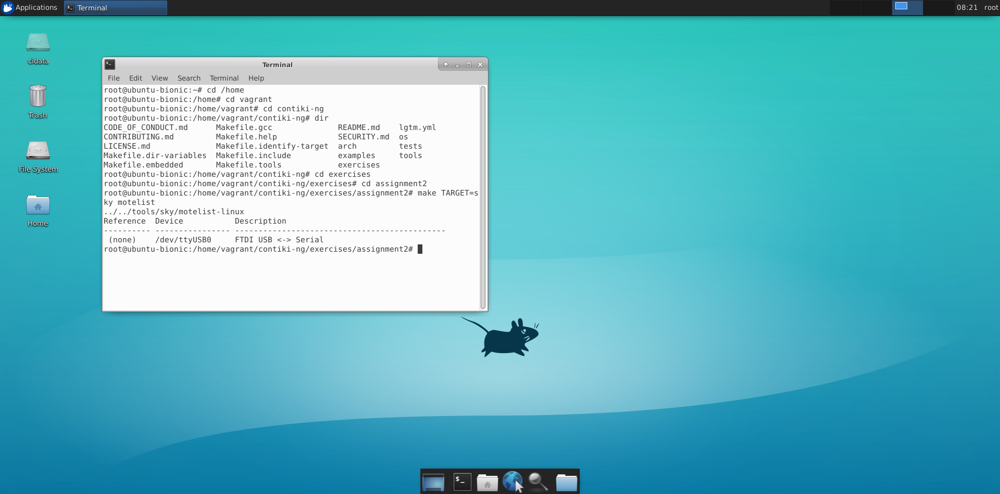
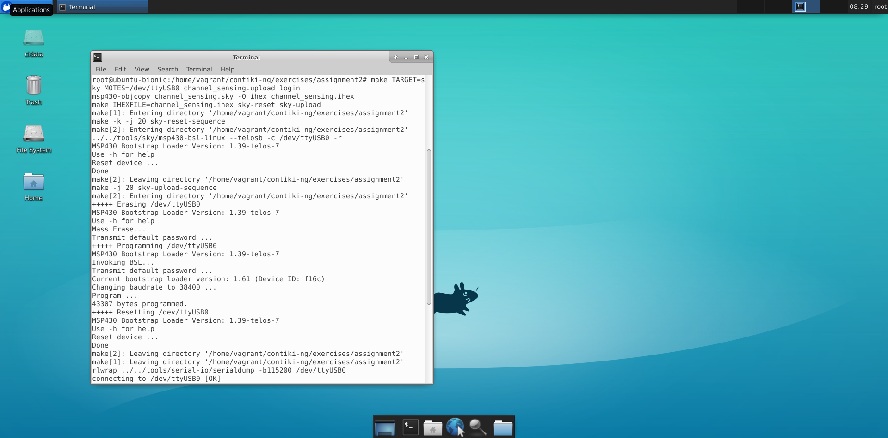
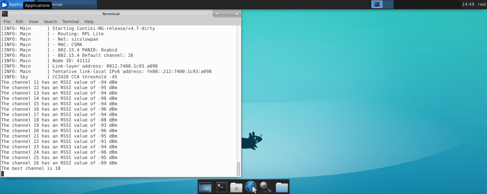
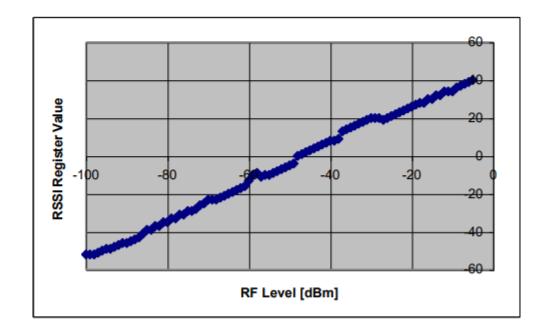

The screenshot of the running of each source code. The data are hard-coded.The result that is very near to the result from matlab file at the bottom, both for matrix reduction method and for the Fast DCT both with 8 bytes processing. Fast DCT is more faster.

The code is runned on a Linux virtual machine, previously setup via Vagrant. 
Cooja simulation envirnoment is possible tu use only with random-mock value of RSSI in dBm (comment and uncomment 
part of code, where instructions are in the code).

A real simulation is made with Crossbow TelosB
- Inside the directory with the c-code channel_sensing.c and Makefile 
- Starting to check the serial port if the Mote is active and connected

`make TARGET=sky motelist`
- Compile, upload, and run the program on the Mote

`make TARGET=sky MOTES=/dev/ttyUSB0 channel_sensing.upload login`
- Output is displayed with each probe and the best channel in dBm 